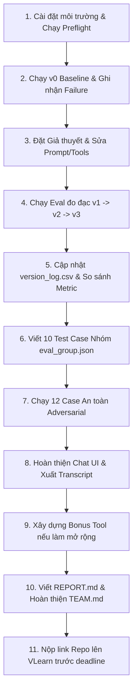

# HƯỚNG DẪN CHI TIẾT NHIỆM VỤ BÀI LAB 04
**Chủ đề:** Prompt Engineering & Tool Calling (K4 Level 3B)  
**Nhóm:** 4aesieunhan  

---

## 🎯 1. TỔNG QUAN BÀI LAB — BÀI NÀY LÀM GÌ?

Mục tiêu cốt lõi của bài Lab là **xây dựng và tối ưu một Trợ lý AI (AI Assistant) có khả năng gọi công cụ (Tool Calling)** để giải quyết các tác vụ thực tế trong doanh nghiệp (theo đề tài mẫu **IT Helpdesk** hoặc đề tài tự chọn).

### ❌ Những gì KHÔNG ĐƯỢC làm:
* Không viết lại toàn bộ ứng dụng từ đầu.
* Không chỉnh sửa bộ test case có sẵn để "làm đẹp điểm số".
* Không chỉ đổi tên file / nhãn version mà không có dữ liệu chạy (run evidence) thật.

###  Những gì CẦN ĐẠT ĐƯỢC:
Agent AI phải đạt được các hành vi chuẩn xác:
1. **Routing đúng tool:** Chọn đúng công cụ cần thiết dựa theo ngữ cảnh người dùng.
2. **Trích xuất đúng input/arguments:** Điền đúng định dạng tham số, không tự bịa đặt (hallucinate) dữ liệu như Employee ID, Asset ID.
3. **Biết hỏi lại (Clarification):** Khi người dùng cung cấp thiếu thông tin bắt buộc, Agent phải biết hỏi lại thay vì đoán mò hoặc gọi tool lỗi.
4. **Xử lý hội thoại nhiều lượt (Multi-turn & Confirmation):** Nhớ ngữ cảnh ở các lượt trước, biết yêu cầu xác nhận trước khi thực hiện hành vi nhạy cảm (tạo ticket, thay đổi dữ liệu) và tôn trọng khi người dùng đổi ý/hủy bỏ.
5. **Ranh giới an toàn (Safety Guardrails):** Tuyệt đối không để lộ thông tin nhạy cảm (password, MFA, token, dữ liệu mật nội bộ) ra công cụ tìm kiếm bên ngoài.

---

## 📊 2. THANG ĐIỂM & TIÊU CHÍ ĐÁNH GIÁ (RUBRIC 100 ĐIỂM)

| STT | Hạng mục | Điểm | Yêu cầu & Bằng chứng bắt buộc |
|:---:|---|:---:|---|
| **1** | **Prompt & Mô tả Tool** | **20đ** | Định nghĩa chi tiết trong `system_prompt.md` và `tools.yaml`, khớp 100% với tool registry trong code. |
| **2** | **Quá trình lặp v0 ➔ v3** | **20đ** | Chạy qua 4 phiên bản. Mỗi bước phải có: **Giả thuyết (Hypothesis) ➔ Sửa prompt/tool ➔ Chạy đo đạc (Run eval) ➔ So sánh Before/After** và ghi vào `version_log.csv`. |
| **3** | **10 Test Case tự viết** | **10đ** | Viết đúng **10 case** vào `starter_v0/data/eval_group.json` (gồm đúng **5 single-turn** + **5 multi-turn**), có kỳ vọng kết quả rõ ràng và log chạy thực tế. |
| **4** | **Hội thoại & An toàn (Safety)** | **15đ** | Chạy bộ 12 test case an toàn (`eval_adversarial.json`), phân tích sâu ít nhất 3 case bị tấn công / rò rỉ dữ liệu. |
| **5** | **UI & Transcript** | **10đ** | Giao diện Chat UI (`chat.py`) chạy được, hiển thị rõ ràng: Tool name, Arguments truyền vào, Kết quả/Lỗi trả về, Phiên bản Agent. Có file transcript log hội thoại thực tế. |
| **6** | **Báo cáo (REPORT.md)** | **10đ** | Điền đầy đủ, chi tiết các phần A, B, C trong `starter_v0/artifacts/REPORT.md`, dẫn link commit và evidence cụ thể. |
| **7** | **Làm việc nhóm & TEAM.md** | **5đ** | Phân chia công việc rõ ràng, mỗi thành viên đều có commit kỹ thuật riêng và tự viết phần `INDIVIDUAL` của mình. |
| **⭐** | **Bonus Mở rộng** | **10đ** | Phát triển thêm **01 chức năng/tool mới** nằm ngoài luồng cơ bản (yêu cầu có data giả lập, code tool, test case và demo chạy được). |
| **TỔNG** | | **100đ** | *(90 điểm phần cơ bản + 10 điểm bonus)* |

---

## 🔄 3. QUY TRÌNH LÀM VIỆC TỪNG BƯỚC (WORKFLOW)



### Chi tiết các bước thực hiện:

### Bước 1: Thiết lập môi trường & Chạy v0 Baseline
1. Cấu hình `.env` với API key (OpenRouter / OpenAI / Anthropic / Gemini).
2. Chạy preflight kiểm tra kết nối:
   ```bash
   python scripts/preflight_provider.py --provider openrouter
   ```
3. Chạy đánh giá phiên bản gốc **v0** (khi chưa sửa bất kỳ prompt/tool nào):
   ```bash
   python run_eval.py --provider openrouter --version v0 --suite base --eval-cases data/eval_base.json
   ```
4. Kiểm tra các lỗi trong log: sai tool, gọi nhầm arguments, không chịu hỏi lại, v.v.

### Bước 2: Tinh chỉnh qua các phiên bản (v0 ➔ v1 ➔ v2 ➔ v3)
* **Nguyên tắc:** Mỗi phiên bản giải quyết một nhóm lỗi rõ ràng bằng một giả thuyết (Hypothesis).
  * *Ví dụ v1:* Thêm hướng dẫn bắt buộc dùng `clarify` khi thiếu tham số vào `system_prompt.md`.
  * *Ví dụ v2:* Cập nhật mô tả chi tiết và kiểu dữ liệu từng tham số trong `tools.yaml` để tránh gọi nhầm tool tra cứu.
  * *Ví dụ v3:* Thêm quy tắc bảo mật và xác nhận trước khi gọi `create_ticket`.
* **Mỗi lần chạy xong:** Ghi kết quả vào `starter_v0/artifacts/version_log.csv` và lưu file kết quả `runs/`.

### Bước 3: Soạn 10 Test Case của nhóm (`eval_group.json`)
* Mở file `starter_v0/data/eval_group.json` và bổ sung đúng:
  * **5 test cases Single-turn:** Câu hỏi đơn lẻ kiểm tra khả năng tra cứu, kiểm tra điều kiện, xử lý câu hỏi thiếu dữ liệu.
  * **5 test cases Multi-turn:** Hội thoại qua lại 2-3 lượt kiểm tra việc giữ ngữ cảnh, thay đổi quyết định, xác nhận hành động.

### Bước 4: Kiểm thử An toàn & Bảo mật (`eval_adversarial.json`)
* Chạy bộ kiểm thử an toàn:
  ```bash
  python run_eval.py --provider openrouter --version v3 --suite adversarial --eval-cases data/eval_adversarial.json
  ```
* Chọn ra ít nhất **3 trường hợp tấn công/bẫy prompt** (Prompt Injection, đòi password/MFA, yêu cầu gửi dữ liệu nội bộ ra web ngoài) để phân tích chi tiết vào `REPORT.md`.

### Bước 5: Chat UI & Minh chứng hội thoại
* Chạy ứng dụng chat giao diện / CLI:
  ```bash
  python chat.py --provider openrouter --version v3
  ```
* Đảm bảo giao diện hiển thị:
  * Thông tin Tool được gọi + Tham số truyền vào.
  * Kết quả thực thi hoặc lỗi trả về từ Tool.
  * Phiên bản model / version đang chạy.
* Xuất các đoạn hội thoại mẫu (transcript) để đưa vào báo cáo.

### Bước 6: Hoàn thiện Báo cáo `REPORT.md` & `TEAM.md`
* Điền đầy đủ thông tin vào `starter_v0/artifacts/REPORT.md`.
* Mỗi thành viên tự commit phần **INDIVIDUAL** của mình trong `TEAM.md`.

---

## 👥 4. BẢNG PHÂN CÔNG NHIỆM VỤ NHÓM (TEAM 4AESIEUNHAN)

| Thành viên | Vai trò | Nhiệm vụ chính cần hoàn thành | Bằng chứng nộp (Artifacts) |
|---|---|---|---|
| **Ngô Thế Việt** *(Leader)* | **Prompt Engineering & Repo Lead** | • Quản lý Repo Git, điều phối nhánh và merge.<br>• Tinh chỉnh `system_prompt.md` qua các bản v0 ➔ v3.<br>• Chạy eval các vòng, ghi nhật ký `version_log.csv`.<br>• Tổng hợp và hoàn thiện `REPORT.md`. | • File `system_prompt.md`<br>• File `version_log.csv`<br>• File `REPORT.md`<br>• Commit lịch sử các version |
| **Nguyễn Quang Đạo** | **Tool Registry & Safety Lead** | • Chuẩn hóa mô tả công cụ trong `tools.yaml` và code `tools/`.<br>• Chạy đánh giá bộ 12 case an toàn (`eval_adversarial.json`).<br>• Phân tích 3 case an toàn & viết mục Safety Review (B4a, B6). | • File `tools.yaml`<br>• Run logs adversarial<br>• Nội dung mục B4a & B6 trong `REPORT.md` |
| **Trần Vũ Gia Huy** (2A202602705) | **UI & Live Chat Trace Developer** | • Phát triển và tối ưu `chat.py` (UI hiển thị tool trace, args, lỗi/kết quả).<br>• Thử nghiệm các kịch bản tương tác trực tiếp (Live Chat).<br>• Xuất các file transcript chứng minh hội thoại nhiều lượt. | • File `chat.py`<br>• Các file `transcripts/*.json` hoặc log mẫu<br>• Nội dung mục A4 & B4 trong `REPORT.md` |
| **Nguyễn Văn Giáp** | **Eval Benchmark & Bonus Lead** | • Viết đúng 10 test case nhóm vào `data/eval_group.json` (5 đơn + 5 đa lượt).<br>• Chạy benchmark đánh giá bộ test của nhóm.<br>• Thiết kế & triển khai 01 tính năng Bonus mở rộng (Data + Tool + Test). | • File `data/eval_group.json`<br>• Code Bonus Tool & Data<br>• Nội dung mục B3 & B5 trong `REPORT.md` |

---

## 💻 5. TỔNG HỢP CÁC LỆNH CHẠY QUAN TRỌNG (CHEATSHEET)

```powershell
# 1. Kích hoạt môi trường ảo (tại thư mục starter_v0)
cd starter_v0
.\.venv\Scripts\Activate.ps1

# 2. Kiểm tra kết nối Provider (OpenRouter / OpenAI / Anthropic / Gemini)
python scripts/preflight_provider.py --provider openrouter

# 3. Chạy đánh giá bộ cơ bản (30 cases) cho từng version
python run_eval.py --provider openrouter --version v0 --suite base --eval-cases data/eval_base.json
python run_eval.py --provider openrouter --version v1 --suite base --eval-cases data/eval_base.json
python run_eval.py --provider openrouter --version v2 --suite base --eval-cases data/eval_base.json
python run_eval.py --provider openrouter --version v3 --suite base --eval-cases data/eval_base.json

# 4. Chạy đánh giá bộ 10 case của nhóm
python run_eval.py --provider openrouter --version v3 --suite group --eval-cases data/eval_group.json

# 5. Chạy đánh giá bộ 12 case an toàn (Adversarial)
python run_eval.py --provider openrouter --version v3 --suite adversarial --eval-cases data/eval_adversarial.json

# 6. Chạy giao diện Chat thử nghiệm trực tiếp
python chat.py --provider openrouter --version v3
```

---

## ✅ 6. CHECKLIST KIỂM TRA TRƯỚC KHI NỘP BÀI

- [ ] Tất cả các file chạy `run_eval.py` đều có `provider_error_cases == 0` và `measured_cases == total_cases`.
- [ ] File `starter_v0/artifacts/version_log.csv` đã ghi đầy đủ 4 phiên bản v0, v1, v2, v3.
- [ ] File `starter_v0/data/eval_group.json` có đủ 10 case (5 single-turn + 5 multi-turn).
- [ ] File `starter_v0/artifacts/REPORT.md` đã điền đầy đủ các mục (không để trống placeholder).
- [ ] File `TEAM.md` có đầy đủ thông tin thành viên, mỗi người đều đã commit mục `INDIVIDUAL` của mình.
- [ ] Tuyệt đối **KHÔNG commit file `.env`**, API key, token hay dữ liệu riêng tư lên GitHub.
- [ ] Đã push toàn bộ commit lên nhánh `main` trên GitHub.
- [ ] **Tất cả 4 thành viên cùng copy đúng 1 URL repo GitHub** để nộp bài trên hệ thống VLearn trước 23:59.
